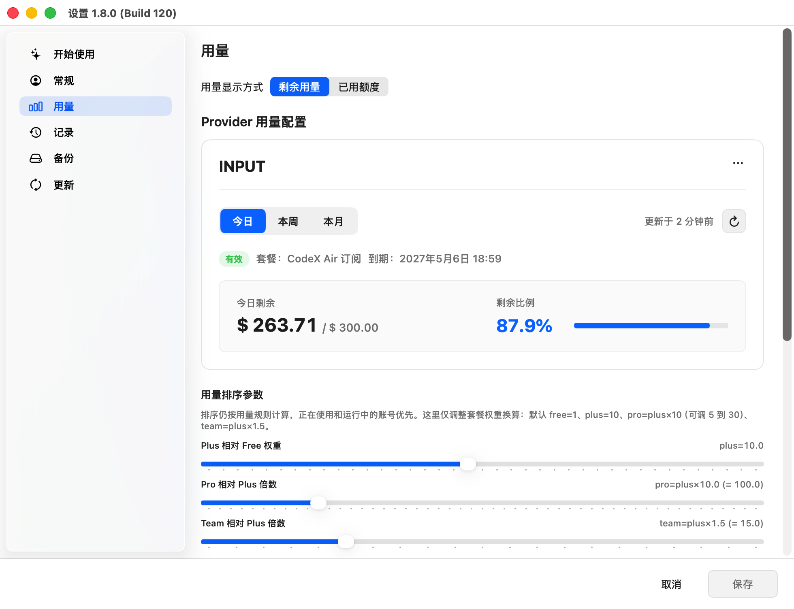
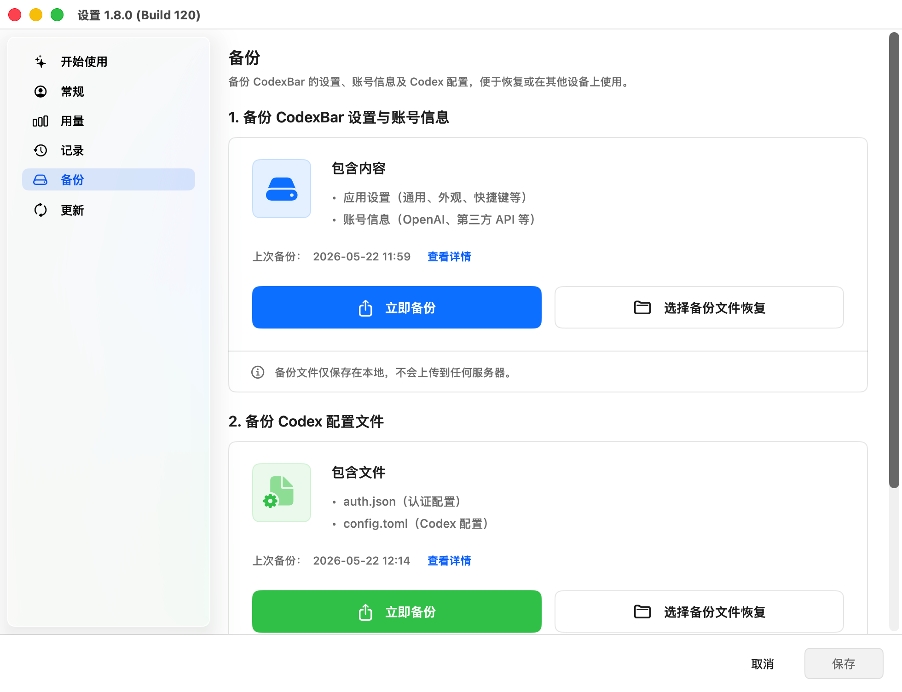
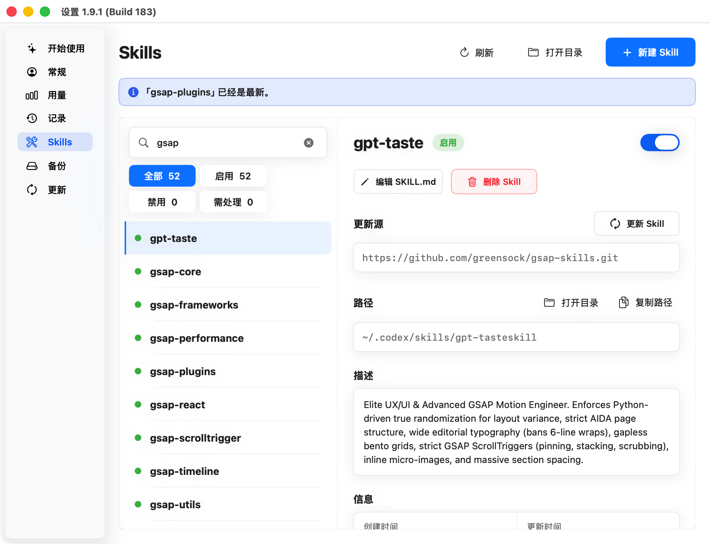

# codexbar

CodexBar is a macOS menu bar control center for Codex Desktop / Codex CLI users who need to manage OpenAI accounts, OpenRouter, third-party OpenAI-compatible relays, cross-account session history, usage tracking, Skills, and an enhanced local gateway.

If you are looking for a Codex account switcher, Codex OpenRouter tool, Codex relay gateway, Codex usage tracker, Codex history manager, Codex Skills manager, or a CCSwitch / cc-switch alternative, CodexBar solves that family of problems with one local visual interface for accounts, models, gateways, history, usage, and Skills.

It is built for Codex Desktop / Codex CLI users who manage multiple OpenAI OAuth accounts, multiple API keys, OpenRouter models, third-party relays, or a shared Codex route across Mac and mobile clients.

Current version: `1.9.2` (Build `205`).

[中文](./README.md)

## Download

Download the latest build from GitHub Releases:

- [Download codexbar](https://github.com/shingex/codexbar/releases)
- Requires macOS 13+
- Requires [Codex Desktop / CLI](https://github.com/openai/codex)

`codexbar` does not bundle any private provider, API key, or personal account configuration. Accounts, keys, and providers stay in your local environment.

## What You Can Do With It

- **Switch Codex accounts and relays visually**: change OpenAI OAuth accounts, OpenRouter keys, third-party OpenAI-compatible providers, and models from the menu bar instead of repeatedly editing `~/.codex/config.toml`.
- **Keep one cross-account history pool**: stop splitting one `CODEX_HOME` per account; `resume`, active sessions, archived sessions, and token statistics stay under one shared `~/.codex`.
- **Manage relay model endpoints**: use OpenRouter and custom OpenAI-compatible providers as Codex request targets while hybrid mode helps preserve Codex plugins, MCP, remote access, and OpenAI-login-dependent behavior.
- **See usage, quota, and reset credits**: summarize local Codex token / usage / cost estimates, inspect third-party provider quota, and query official reset credits.
- **Manage Codex session records**: browse cross-account sessions, copy `codex resume <sessionID>`, inspect tokens, models, and conversation directories, and delete local sessions you no longer need.
- **Manage and update local Skills**: search, enable / disable, inspect sources, check updates, create, and delete Skills under `~/.codex/skills`.
- **Use an enhanced local gateway**: integrate Headroom-style local compression to save tokens and Retry Gateway-style 516 handling to turn specific failures into retryable paths.
- **Share one route over LAN**: local gateways can listen on LAN-capable addresses, so phones or other devices can use the Mac LAN IP and the same Codex route.
- **Back up and restore locally**: back up CodexBar settings / account data separately from Codex `auth.json` and `config.toml`, making migration and recovery easier.
- **Sub2API account interoperability**: import and export OpenAI accounts through CSV for batch account cleanup and migration.

## How It Differs From a Simple Switcher

Many Codex switchers mainly answer "which account or base URL should Codex use now?" CodexBar is closer to a local Codex control center:

| Problem | Script / lightweight switcher | CodexBar |
|---------|-------------------------------|----------|
| Multi-account switching | Mostly edits config | Visual menu bar switching for accounts, providers, OpenRouter keys, and models |
| Session history | Often split across multiple `CODEX_HOME` folders | One shared `~/.codex` for cross-account browsing, resume, archive state, and deletion |
| Relays | Usually changes `openai_base_url` | Hybrid mode helps keep plugins, MCP, remote access, and account-state behavior |
| Usage visibility | External billing or manual parsing | Local usage / token / cost estimates, provider quota, and official reset-credit queries |
| Skills | Usually out of scope | Manage, enable, disable, update, create, and delete local Skills |
| Gateway enhancements | Usually requires separate tools | Built-in Headroom-style compression and Retry Gateway-style 516 handling |

## Why codexbar

Codex account and provider configuration ultimately lands in `~/.codex/config.toml` and `~/.codex/auth.json`. Manual switching between accounts, relays, and OpenRouter can quickly become fragile:

- multi-account workflows split session history across directories
- directly changing `openai_base_url` can break plugins, MCP, or features that expect OpenAI login state
- OpenRouter keys and models grow hard to manage in the main config
- local session records, archived records, and deletion lack one management surface
- Skills are scattered under `~/.codex/skills`, with source, enabled state, and update status hard to see
- Headroom compression, 516 retry handling, and other gateway behaviors require extra wiring
- desktop, mobile, and remote clients cannot easily share one route
- local token usage, provider quota, official reset credits, and backup state lack a single view

`codexbar` keeps one shared `~/.codex`, lets the menu bar manage accounts, providers, models, gateways, history, and Skills, then synchronizes the minimum required Codex configuration for the current mode.

## Screenshots

### Menu Bar Panel

The main panel shows the current mode, OAuth account, model, local usage estimate, provider quota progress, and quick switching entries for Provider / OpenRouter targets.

<p align="center">
  
</p>

### Getting Started

The Getting Started screen brings mode selection, OpenAI account connection, and third-party API key setup into one guided entry point.

<p align="center">
  
</p>

### Settings and Session Records

The settings window includes account, records, usage, backup, and update sections. The records page lets you browse cross-account Codex sessions, copy `codex resume` commands, inspect a session's token totals, model, and conversation turns, and delete local sessions you no longer need.

<p align="center">
  
</p>

### Usage Page

The usage page can switch between remaining quota and used quota, show provider quota for today, this week, and this month, and tune package weights that affect account ordering. OpenAI accounts can also query locally cached official reset credits.

<p align="center">
  
</p>

### Local Backup

The backup page separates CodexBar settings / account data from Codex configuration files. Backup files stay local and are not uploaded to any server.

<p align="center">
  
</p>

### Skills Page

The Skills page manages local `~/.codex/skills`: search by name, description, or path, inspect each Skill's description, update source, and file details, then enable / disable, update, create, or delete Skills.

<p align="center">
  
</p>

## OpenAI Usage Modes

### Manual mode

Writes the selected OpenAI OAuth account into Codex config. Use this when you want to explicitly choose one current account.

### Aggregate mode

Treats usable OpenAI OAuth accounts as a local account pool. The codexbar gateway accepts requests and routes them per session, which is useful when several accounts have quota and you want fewer manual switches.

Aggregate mode only pools OpenAI OAuth accounts. OpenRouter and custom providers do not join the aggregate pool.

### Hybrid mode

Keeps an OpenAI OAuth account as the login identity while routing actual requests to OpenRouter or a custom OpenAI-compatible provider. Use this when you already rely on a relay or OpenRouter but still want Codex plugins, MCP, remote access, and account-state-dependent behavior to keep working.

Desktop Codex sync uses stable local addresses:

- OpenAI gateway: `127.0.0.1:1456`
- OpenRouter gateway: `127.0.0.1:1457`

Mobile clients or other LAN devices should use the Mac LAN IP with the corresponding port.

## Shared Session History

`codexbar` keeps one `~/.codex` by default:

- `~/.codex/sessions`
- `~/.codex/archived_sessions`
- `~/.codex/config.toml`
- `~/.codex/auth.json`

Switching accounts or providers only affects future requests and future sessions. Existing sessions remain in the same history pool.

The records page works on that shared history pool:

- filter local Codex sessions by all / active / archived
- search by title, directory, session ID, or model
- copy `codex resume <sessionID>` commands
- inspect a session's tokens, model, directory, and messages
- delete local sessions you no longer need

## OpenRouter Management

OpenRouter supports multiple keys, multiple models, and per-key selection state:

- each OpenRouter API key can keep its own selected model and pinned model list
- new keys do not inherit another key's current model state
- editing a key can update the API key, label, and checked models
- the menu panel expands checked models as direct manual switching entries
- large model catalogs are not written into the main config, avoiding pollution in `~/.codexbar/config.json`

This is useful when you maintain several OpenRouter keys, model entry points, or purpose-specific key routes.

## Relays and Remote Access

When using a custom OpenAI-compatible provider, you can:

- route requests directly to the provider
- keep OpenAI OAuth login state through hybrid mode while routing requests to the provider
- expose the same route to mobile or remote devices through the LAN gateway

Current gateway ports:

- OpenAI gateway: `0.0.0.0:1456`
- OpenRouter gateway: `0.0.0.0:1457`

Local Codex config still writes `127.0.0.1`; mobile clients should use the Mac LAN IP instead.

## Local Usage and Cost Estimates

`codexbar` scans local session files to show token, usage, and cost estimates.

Sources:

- `~/.codex/sessions`
- `~/.codex/archived_sessions`

Token accounting:

- `input + cached_input + output`

Notes:

- this is a local usage estimate, not an official OpenAI invoice
- no remote usage is fetched or aggregated
- unpriced models count as `0` cost while token totals remain visible
- custom provider cost estimates may differ from upstream billing

## Provider Quota Management

The usage page reads provider quota data and surfaces remaining or used quota in both the menu bar and settings window. OpenAI OAuth accounts can also query official reset credits and cache the result locally.

Available ranges:

- today
- this week
- this month

Sortable weight parameters:

- Plus relative to Free
- Pro relative to Plus
- Team relative to Plus

These parameters only affect CodexBar's local ordering in multi-account and multi-package setups. They do not change the real provider plan or billing state.

## Skills Management

CodexBar reads local `~/.codex/skills` and puts Skill maintenance inside the settings window:

- search Skill names, descriptions, or paths
- inspect `SKILL.md` metadata, source repositories, and file details
- enable or disable individual Skills
- check GitHub source updates and generate update commands
- create new Skills
- delete Skills you no longer need

When a `SKILL.md` includes a GitHub repository URL in the first 80 lines after `source:`, `repository:`, `repo:`, `canonical:`, or `Converted from:`, CodexBar can use it as the update source.

## Enhanced Gateway

CodexBar's local gateway does more than forward requests. It adds behavior built around Codex workflows:

- **Headroom compression**: inserts a local compression adapter before OpenAI gateway egress and applies configurable compression to gateway responses / compact requests to reduce unnecessary token use.
- **Retry Gateway 516 handling**: when response reasoning tokens match configured failure patterns, the gateway can turn the result into a retryable error so Codex can request again.
- **Account-pool routing**: aggregate mode routes sessions across an OpenAI OAuth account pool to reduce manual switching.
- **Relay hybrid routing**: hybrid mode keeps OpenAI OAuth login state while sending the actual request to OpenRouter or a custom OpenAI-compatible provider.

## Local Backup and Restore

The backup page provides two local backup types:

- CodexBar settings and account data: app preferences, appearance, shortcuts, and OpenAI / third-party API account information
- Codex configuration files: `auth.json` and `config.toml`

Backup files stay on your Mac. During restore, you choose the matching backup file to import, which is useful when moving to a new Mac, recovering from accidental config changes, or sharing the same CodexBar / Codex setup across devices.

## OpenAI Login

OpenAI login uses browser authorization with localhost callback capture and a manual fallback.

Steps:

1. Click the person-plus button in the menu bottom toolbar
2. Finish OpenAI authorization in the browser
3. The browser redirects to `http://localhost:1455/auth/callback?...`
4. `codexbar` captures the callback and imports the account

If automatic capture fails, paste the full callback URL or raw `code` back into the login window.

## Updates

`codexbar` checks GitHub Releases for installable stable versions:

- non-blocking update check on launch
- manual "Check for Updates" entry in the menu bar
- skips `draft`, `prerelease`, and releases without `dmg` / `zip` installer assets
- current update flow is guided download / install; the app does not replace the old app or restart itself automatically

See the update strategy:

- [docs/update-feed-rollout.md](./docs/update-feed-rollout.md)

## Build Locally

```sh
git clone https://github.com/shingex/codexbar.git
cd codexbar
open codexbar.xcodeproj
```

Then:

1. Select your signing team in Xcode
2. Build and run the `codexbar` target

If you only want to use the app, download it from [GitHub Releases](https://github.com/shingex/codexbar/releases) instead.

## Who This Is For

`codexbar` is useful if you:

- use multiple OpenAI OAuth accounts
- want Codex multi-account session history in one place instead of several `CODEX_HOME` directories
- use OpenRouter, third-party OpenAI API relays, or self-hosted OpenAI-compatible services
- want to keep Codex plugins, MCP, and account-state-dependent features working when using a relay
- want to manage, update, or clean up local `~/.codex/skills`
- want Headroom-style compression and 516 handling to reduce token waste and failure interruptions
- need to share one Codex route across Mac, phone, and remote devices
- want local Codex token usage, cost estimates, provider quota, and official reset credits

## Star History

<p align="center">
  <a href="https://star-history.com/#shingex/codexbar&Date">
    <picture>
      <source
        media="(prefers-color-scheme: dark)"
        srcset="https://api.star-history.com/svg?repos=shingex/codexbar&type=Date&theme=dark"
      />
      <source
        media="(prefers-color-scheme: light)"
        srcset="https://api.star-history.com/svg?repos=shingex/codexbar&type=Date"
      />
      
    </picture>
  </a>
</p>

## Acknowledgements

This project continues from the original `codexbar` direction and references or adapts ideas and parts of the implementation from these projects:

- [lizhelang/codexbar](https://github.com/lizhelang/codexbar)
- [xmasdong/codexbar](https://github.com/xmasdong/codexbar)
- [steipete/CodexBar](https://github.com/steipete/CodexBar)
- [farion1231/cc-switch](https://github.com/farion1231/cc-switch)

See also:

- [THIRD_PARTY_NOTICES.md](./THIRD_PARTY_NOTICES.md)

## License

[MIT](./LICENSE)
