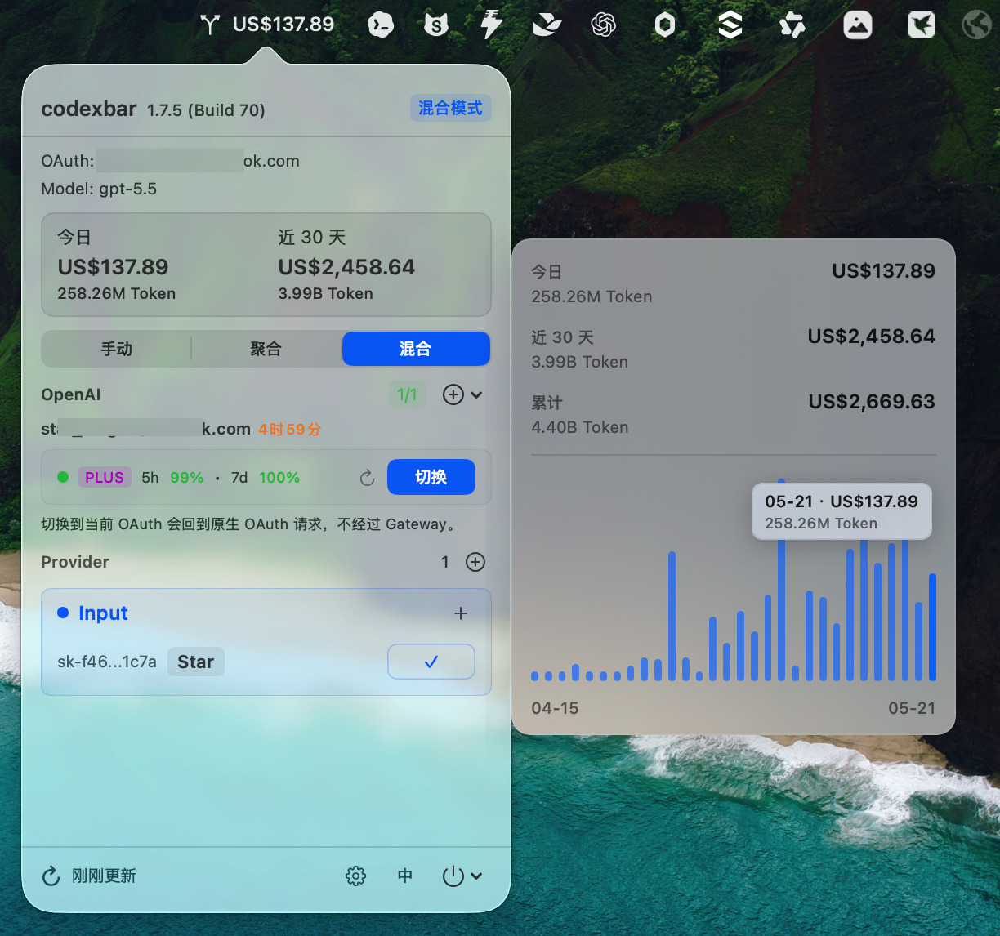
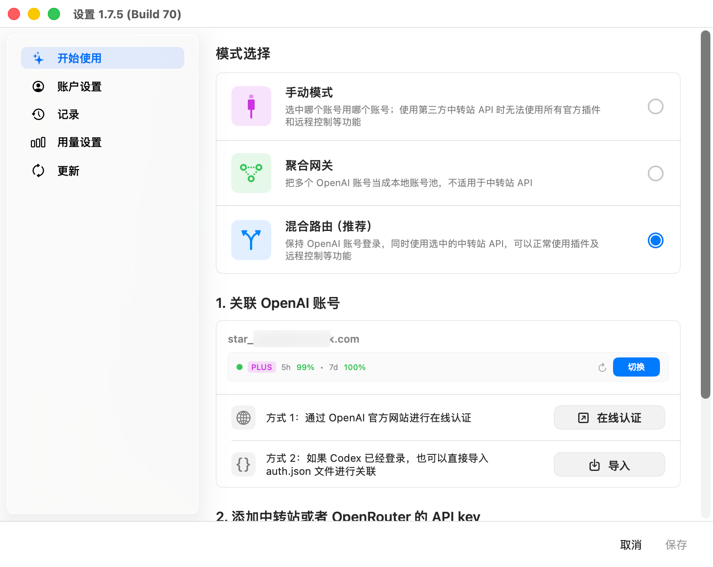
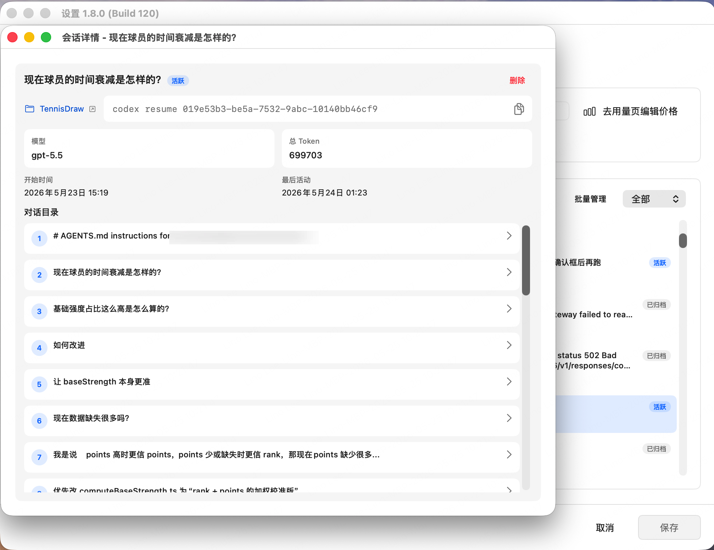

# codexbar

让 Codex Desktop 更好用的 macOS 菜单栏工具：统一管理 OpenAI 多账号、OpenRouter、第三方 OpenAI 兼容中转站、本地网关、远程访问和用量统计。

`codexbar` 适合已经在使用 Codex Desktop / Codex CLI 的用户，尤其是同时维护多个 OpenAI OAuth 账号、多个 API Key、OpenRouter 模型、第三方中转站，或者需要在 Mac 与移动端之间共享同一套 Codex 路由的人。

当前版本：`1.7.2`（Build `59`）。

[English](./README.en.md)

## 下载

从 GitHub Releases 下载最新版：

- [下载 codexbar](https://github.com/shingex/codexbar/releases)
- 运行环境：macOS 13+
- 需要已安装并使用 [Codex Desktop / CLI](https://github.com/openai/codex)

`codexbar` 不内置任何私有 provider、API Key 或账号配置。所有账号、Key 和 provider 都只在你的本机配置。

## 核心能力

- **一个 `~/.codex` 管理多账号**：不再为每个账号拆一套 `CODEX_HOME`，会话历史、resume、归档记录继续保留在同一个历史池里。
- **OpenAI 多账号聚合网关**：把多个 OpenAI OAuth 账号作为本地账号池，减少手动切号和重复恢复现场。
- **中转站也能保留插件能力**：混合路由保留 OpenAI OAuth 登录态，同时把实际请求转到 OpenRouter 或自定义 OpenAI 兼容 provider，尽量保留 Codex 插件、MCP、远程访问等依赖账号态的能力。
- **更好的 OpenRouter 管理**：每个 OpenRouter Key 独立管理模型选择、固定模型和当前模型，适合多 Key、多模型、多供应商路由。
- **局域网远程控制 / 移动端访问**：本地 gateway 监听局域网地址，手机或其他设备可以通过 Mac 的局域网 IP 访问同一套路由。
- **本地用量与成本估算**：扫描 `~/.codex/sessions` 和 `~/.codex/archived_sessions`，汇总 token、usage 和模型成本估算。
- **Sub2API 账号互通**：支持 OpenAI 账号 CSV 导入 / 导出，方便批量迁移和整理账号。

## 为什么需要 codexbar

Codex 的账号和 provider 配置最终会落到 `~/.codex/config.toml` 与 `~/.codex/auth.json`。如果手动切换账号、中转站或 OpenRouter，很容易遇到几个问题：

- 多账号切换后，会话历史被不同目录拆散
- 直接改 `openai_base_url` 后，插件、MCP 或依赖 OpenAI 登录态的功能不稳定
- OpenRouter Key 和模型越来越多，主配置变得难维护
- 桌面端、移动端、远程设备无法方便复用同一套路由
- 本地 token 用量和成本缺少统一视图

`codexbar` 的做法是：保留一个共享的 `~/.codex`，用菜单栏管理账号、provider、模型和 gateway，再按当前模式把最小必要配置同步给 Codex。

## 截图

### 菜单栏主面板

主面板集中展示当前模式、OAuth 账号、模型、本地用量估算，以及 Provider / OpenRouter 的快速切换入口。

<p align="center">
  
</p>

### 开始使用

开始使用界面提供模式选择、OpenAI 账号关联和第三方 API key 添加入口，帮助你更快完成基础设置。

<p align="center">
  
</p>

### 设置与会话记录

设置窗口提供账号、记录、用量和更新入口；记录页可以浏览本机 Codex 会话，并进入用量价格编辑。

<p align="center">
  
</p>

## OpenAI 使用模式

### 手动模式

把指定 OpenAI OAuth 账号写入 Codex 配置。适合只想明确使用某一个账号的场景。

### 聚合模式

把多个可用 OpenAI OAuth 账号作为本地账号池，由 codexbar gateway 承接请求并按会话路由。适合多个账号都有额度，希望少切号、少打断工作流的场景。

聚合模式只聚合 OpenAI OAuth 账号，不会把 OpenRouter 或自定义 provider 混入账号池。

### 混合模式

保留 OpenAI OAuth 账号作为登录态，把实际请求目标切到 OpenRouter 或自定义 OpenAI 兼容 provider。适合已经使用中转站或 OpenRouter，但仍希望保留 Codex 插件、MCP、远程访问和账号态能力的场景。

桌面端同步到 Codex 时使用本机稳定地址：

- OpenAI gateway：`127.0.0.1:1456`
- OpenRouter gateway：`127.0.0.1:1457`

移动端或其他局域网设备访问时，使用 Mac 的局域网 IP 加对应端口。

## 共享会话历史

`codexbar` 默认只维护一个 `~/.codex`：

- `~/.codex/sessions`
- `~/.codex/archived_sessions`
- `~/.codex/config.toml`
- `~/.codex/auth.json`

切换账号或 provider 只影响之后发起的新请求和新会话，不会把既有 session 拆到多个目录里。

## OpenRouter 管理

OpenRouter 支持多 Key、多模型和独立选择状态：

- 每个 OpenRouter API Key 可以独立保存当前模型和固定模型列表
- 新增 Key 不会继承其他 Key 的当前模型状态
- 编辑 Key 时可以修改 API Key、标签和模型勾选
- 菜单栏主面板可直接展开已勾选模型，作为手动切换入口
- 大体量模型目录不会写入主配置，避免污染 `~/.codexbar/config.json`

这适合同时维护多个 OpenRouter Key、多个模型入口，或者需要按 Key 分离用途的 Codex 用户。

## 中转站与远程访问

使用自定义 OpenAI 兼容 provider 时，可以选择：

- 直接把请求转到 provider
- 通过混合模式保留 OpenAI OAuth 登录态，再把请求路由到 provider
- 通过局域网 gateway 让移动端或远程设备访问 Mac 上的同一套路由

当前 gateway 端口：

- OpenAI gateway：`0.0.0.0:1456`
- OpenRouter gateway：`0.0.0.0:1457`

Codex 本机配置仍写入 `127.0.0.1`，移动端访问时改用 Mac 的局域网 IP。

## 本地用量与成本估算

`codexbar` 会扫描本地 session 文件，展示 token、usage 和成本估算。

统计来源：

- `~/.codex/sessions`
- `~/.codex/archived_sessions`

token 口径：

- `input + cached_input + output`

注意：

- 这是本地 usage estimate，不是 OpenAI 官方账单
- 不会额外拉取或聚合远端 usage
- 未配置价格的模型按 `0` 成本处理，但 token 仍会统计
- 自定义 provider 的估算金额可能与供应商真实扣费不同

## OpenAI 登录

OpenAI 登录采用浏览器授权加 localhost 回调捕获，必要时支持手动粘贴回调。

操作流程：

1. 点击菜单底部工具栏的人像加号按钮
2. 在浏览器完成 OpenAI 授权
3. 浏览器跳转到 `http://localhost:1455/auth/callback?...`
4. `codexbar` 自动捕获回调并导入账号

如果自动捕获失败，可以把完整回调 URL 或单独的 `code` 粘贴回登录窗口。

## 更新

`codexbar` 会检查 GitHub Releases 中可安装的稳定版本：

- 启动时非阻塞检查更新
- 菜单栏支持手动“检查更新”
- 跳过 `draft`、`prerelease` 和不带 `dmg` / `zip` 安装包的 release
- 当前更新方式是引导下载 / 安装，不会自动替换旧 app 或自动重启

详细更新策略见：

- [docs/update-feed-rollout.md](./docs/update-feed-rollout.md)

## 本地构建

```sh
git clone https://github.com/shingex/codexbar.git
cd codexbar
open codexbar.xcodeproj
```

然后：

1. 在 Xcode 里选择自己的签名团队
2. 构建并运行 `codexbar` target

如果只是使用，不需要本地构建，直接从 [GitHub Releases](https://github.com/shingex/codexbar/releases) 下载即可。

## 适合谁

`codexbar` 适合这些 Codex 用户：

- 同时使用多个 OpenAI OAuth 账号
- 想合并 Codex 多账号会话记录，而不是拆多个 `CODEX_HOME`
- 使用 OpenRouter、第三方 OpenAI API 中转站或自建 OpenAI 兼容服务
- 希望中转站场景下尽量保留 Codex 插件、MCP 和账号态能力
- 需要在 Mac、手机、远程设备之间共享同一套 Codex 路由
- 想在本地查看 Codex token 用量和成本估算

## Star 历史

<p align="center">
  <a href="https://star-history.com/#shingex/codexbar&Date">
    <picture>
      <source
        media="(prefers-color-scheme: dark)"
        srcset="https://api.star-history.com/svg?repos=shingex/codexbar&type=Date&theme=dark"
      />
      <source
        media="(prefers-color-scheme: light)"
        srcset="https://api.star-history.com/svg?repos=shingex/codexbar&type=Date"
      />
      
    </picture>
  </a>
</p>

## 致谢

这个项目基于原始 `codexbar` 方向继续演进，并参考、改造了下面 MIT 许可证项目中的思路与部分实现：

- [lizhelang/codexbar](https://github.com/lizhelang/codexbar)
- [xmasdong/codexbar](https://github.com/xmasdong/codexbar)
- [steipete/CodexBar](https://github.com/steipete/CodexBar)
- [farion1231/cc-switch](https://github.com/farion1231/cc-switch)

详细说明见：

- [THIRD_PARTY_NOTICES.md](./THIRD_PARTY_NOTICES.md)

## License

[MIT](./LICENSE)
